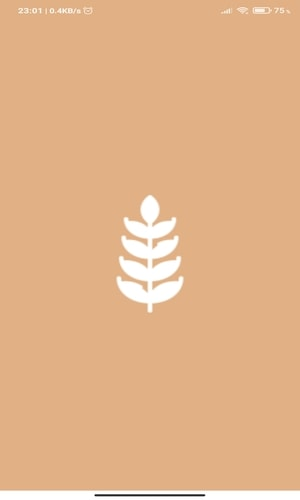
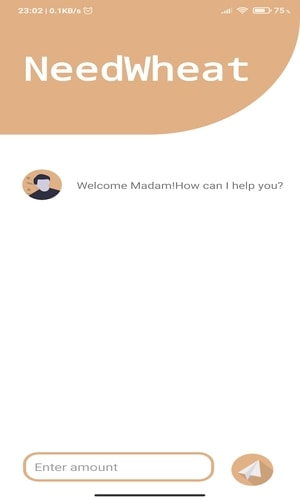
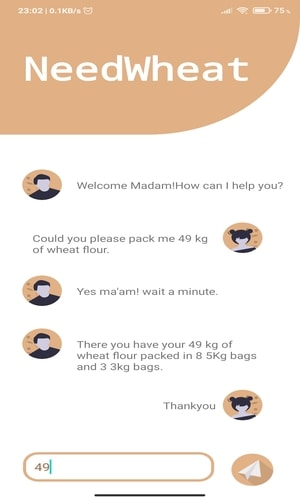
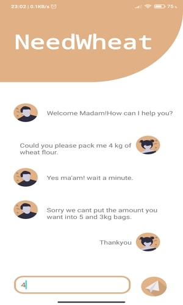

# NeedWheat

A fun app in which the customer ask for som amount of wheat flour and shopkeeper pack it in the bags of 5 and 3 kgs. if the amount provided by the customer can not be form form 
the sum of 5's and 3's the shopkeeper display a message.

## App ScreenShot
<table>
  <tr>
    <td>Splash Screen</td>
    <td>Main Page</td>
  </tr>
  <tr>
    <td></td>
    <td></td>
  </tr>
  <tr>
    <td>Amount valid</td>
    <td>Amount not valid</td>
  </tr>
  <tr>
    <td></td>
    <td></td>
  </tr>
  </table>
